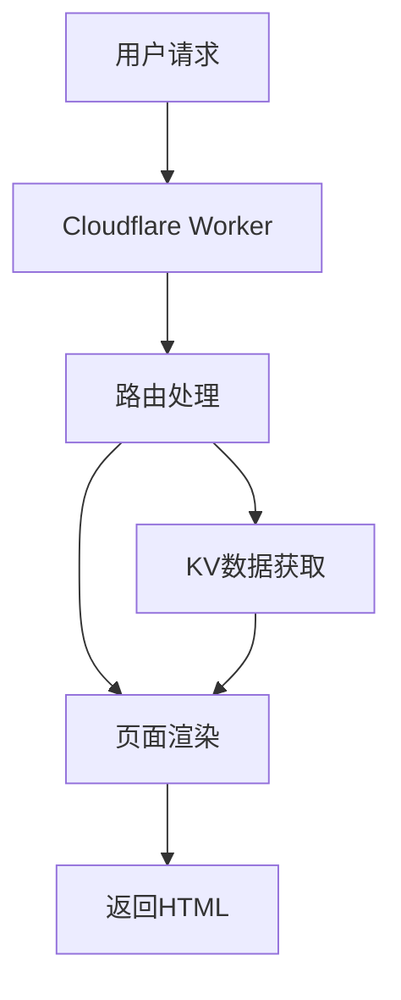

# CloudDocs 项目开发计划

## 1. 项目架构设计

### 1.1 技术栈选择
- 样式处理: TailwindCSS
- 部署平台: Cloudflare Workers
- 数据存储: Cloudflare KV
- Markdown 解析: markdown-it

### 1.2 系统架构


## 2. 开发阶段规划

### 2.1 基础框架搭建
- [ ] 创建 Worker 项目
- [ ] 配置开发环境
- [ ] 设计路由系统
- [ ] 实现基础页面模板

### 2.2 文档存储系统
- [ ] 设计 KV 存储结构
- [ ] 实现文档上传接口
- [ ] 实现文档缓存机制
- [ ] 文档版本控制

### 2.3 页面渲染系统
- [ ] Markdown 渲染引擎
- [ ] 代码高亮支持
- [ ] 响应式布局
- [ ] 主题定制系统

### 2.4 功能模块开发

#### 导航系统
- [ ] 顶部导航栏
- [ ] 侧边栏目录
- [ ] 面包屑导航
- [ ] 文档搜索功能

#### 文档增强
- [ ] 目录自动生成
- [ ] 代码复制功能
- [ ] 图片预览
- [ ] 深色模式支持

#### 交互功能
- [ ] 文档编辑历史
- [ ] 文档评论系统
- [ ] 在线编辑功能

## 3. 部署与优化

### 3.1 部署配置
- [ ] Worker 部署脚本
- [ ] 自动化部署流程
- [ ] 域名绑定
- [ ] SSL 配置

### 3.2 性能优化
- [ ] 静态资源缓存
- [ ] 图片优化
- [ ] 按需加载
- [ ] 首屏优化

### 3.3 监控与统计
- [ ] 访问统计
- [ ] 错误监控
- [ ] 性能监控
- [ ] 用户行为分析

## 4. 项目文件结构

```bash
cloudocs/
├── src/
│   ├── components/    # Vue组件
│   ├── layouts/      # 页面布局
│   ├── styles/       # 样式文件
│   ├── utils/        # 工具函数
│   └── worker/       # Worker相关代码
├── docs/            # 文档源文件
├── public/          # 静态资源
├── scripts/         # 构建脚本
├── wrangler.toml    # Worker配置
└── package.json
```

## 5. 开发时间线

1. **第一阶段** (2周)
   - 基础框架搭建
   - KV存储系统实现
   - 基础页面渲染

2. **第二阶段** (3周)
   - 导航系统开发
   - Markdown渲染优化
   - 主题系统实现

3. **第三阶段** (2周)
   - 搜索功能实现
   - 性能优化
   - 部署系统搭建

4. **第四阶段** (1周)
   - 测试与修复
   - 文档编写
   - 上线准备

## 6. 注意事项

1. **性能考虑**
   - 使用 KV 的读取限制
   - Worker 的运行时限制
   - 缓存策略的合理使用

2. **安全考虑**
   - 文档访问权限控制
   - API 接口安全
   - 数据备份策略

3. **可扩展性**
   - 模块化设计
   - 插件系统支持
   - 自定义主题支持 